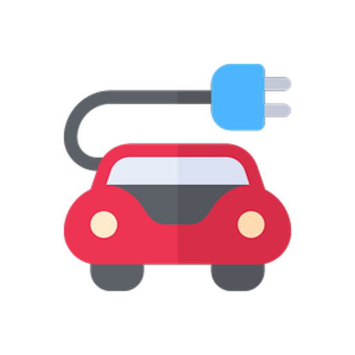

# MiCocheEléctrico Exporter

Exporta automáticamente los datos de tu vehículo desde Home Assistant a la app **MiCocheEléctrico**.

La integración es compatible con cualquier vehículo soportado por Home Assistant y envía periódicamente la información a tu cuenta de MiCocheEléctrico.

## Características

- 🔋 Nivel de batería
- 🚗 Autonomía
- 📏 Odómetro
- ⚡ Estado de carga
- 📍 Posición GPS
- 🔄 Actualización automática cada minuto

## Instalación

1. Instala la integración desde HACS.
2. Reinicia Home Assistant.
3. Ve a **Ajustes → Dispositivos y servicios**.
4. Añade **MiCocheEléctrico Exporter**.
5. Introduce el token generado en la aplicación MiCocheEléctrico desde tu perfil.
6. Selecciona los sensores correspondientes a tu vehículo.
7. Continúa la configuración en la app "Micocheeléctrico"

## App
Búscala como "Mi coche eléctrico" en Google play o la App Store.
🌐 https://micocheelectrico.abrir.gal 

## Código fuente

https://github.com/oscarabilleira/micocheelectrico_exporter

## Licencia

MIT